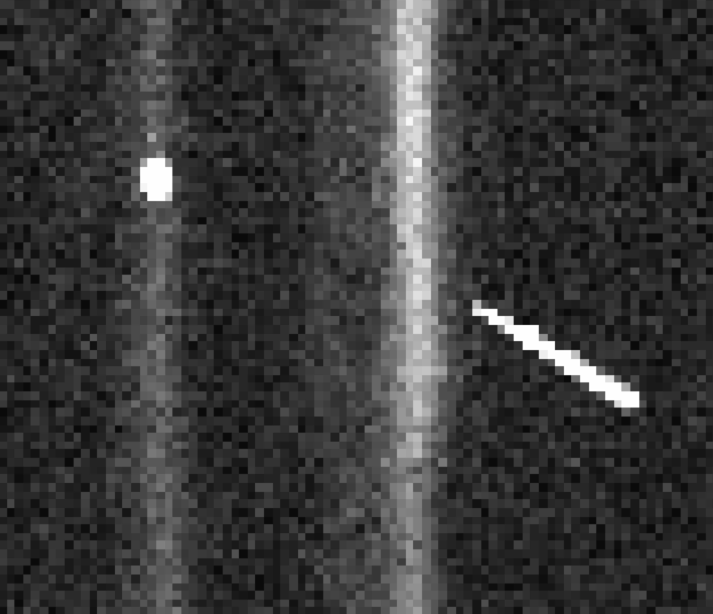
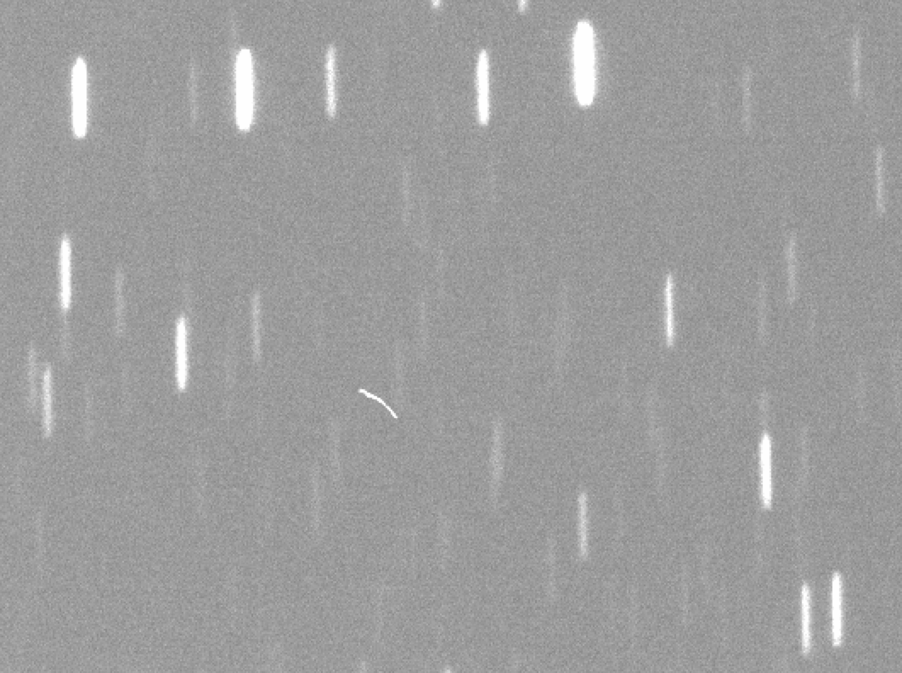

# DECam Star Trails
We are preparing to capture the full opportunity of our [approved observing proposal](https://github.com/davidthomas5412/StarTrailProposal_NOAO2019a/blob/master/dthomas50094253655.pdf). 

**News:** 
The DECam team gave us 30 minutes to practice taking star trail exposures during engineering time on Monday May 27th. The data is currently being processed; the raw data looks very promising.

Cosmic rays near a trail: 
0.1 second trails: 

**Already Validated:**

- We control the telescope manually. We break up the survey into sequences consisting of one static image followed by two trailing images at the same location. Here is the operation:
	- We observe the first science position while tracking.  
	- A ‘brake’ stops the queue.
	- We tell the telescope operator (TO) to stop tracking.
	- TO confirms tracking is OFF.
	- We wait 30 seconds for telescope to settle.
		- Meanwhile we set the AOS system to focus only via "init_pid aos1" in architecture control.
	- Start first image with tracking off (no coordinates on json)
	- Start second image with tracking off (no coordinates on json)
	- A ‘brake’ stops the queue.
	- We tell the TO to turn track ON.
		- Meanwhile we turn the AOS control back on via "init_pid aos8" in architecture control.
	- TO confirms track is on.
	- REPEAT
- Simulations match real data.
- Mechanical vibrations are not an issue.
- Repeatedly toggling the tracking and donut processing does not harm the telescope.
- We can take exposures as short as 0.1 seconds without harming the camera.
- For each sequence of three exposures the downtime is seconds 95 seconds, not including exposure time. Hence with 15 second exposures the duty cycle is 38% whereas with 0.1 second exposures it is 0.31%.

**To Validate:**

- Work with Frank Valdez to understand how different subtasks in the DECam community pipeline are effected by star trail images.
- Confirm we can match stars from trailed images to their corresponding static images.

**Optimizing Survey:** We have the opportunity to refine our basic survey footprint and exposure sequences. How should we optimize targets, exposure times, filters?

**Research Questions:**

- Do we need to use deep learning to detect sudden flux changes? It is extremely expensive to generate the enormous volume of data necessary to train the network. Is it possible that something like Federica uses in (https://iopscience.iop.org/article/10.1088/0004-6256/138/2/568/meta) will work?
- What if we examined the spatio-temporal correlations of the wiggles in streaks. Could this be an effective way to characterize ground level atmospheric turbulence, which will be important for LSST?
- Most cosmic rays leave clearly discernable tracks. However, the image above is a case that shows how they could look like bursts.
- Calculate anticipated event rates for different science use cases with empirically determined sensitivity curves (detection efficiency for events with default flux, delta flux, and delta duration). 